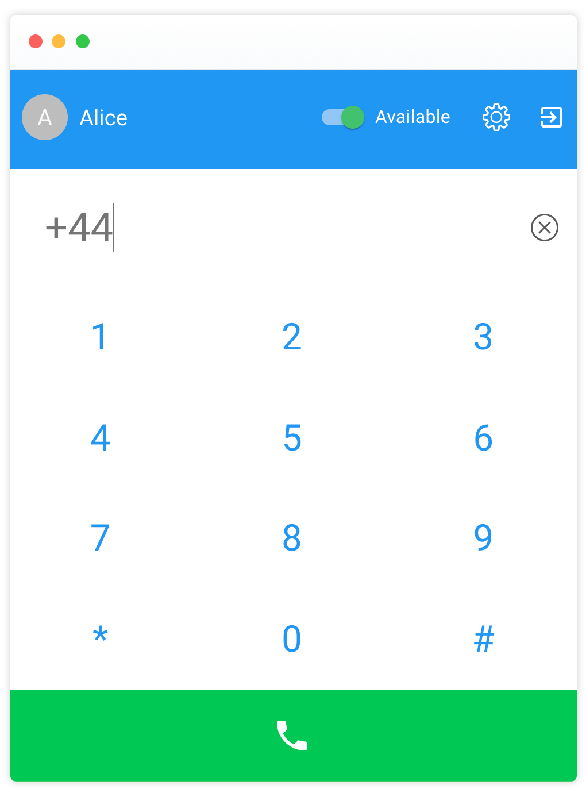

# Summer Camp

Summer Camp is a free WebRTC telephony application built in Typescript and React. It is a phone for a single user and supports inbound and outbound calls.

<p align="center">
    
</p>

## Features

- Call a phone number
- Receive phone calls
- Mute/unmute yourself while on call
- Send DTMF tones
- Set yourself **available** or **unavailable**. If the user is unavailable callers will hear a text-to-speech voice saying the caller is currently not online
- Manage presence, if the user is not online the calls are rejected with a message to the caller

## Application Architecture

The project is split into two parts, the React UI source code in `/src` and the server you find in`/src-server`

### NodeJS Server

The server authenticates users and keeps a WebSocket connection to the phone client, this allows the server to manage the user's presence on the browser and reject a call if the user is not online.

The server has a RESTful API users can use with a valid JWT token issues by login route. You find the API descrption in OpenAPI 3 format in the project director [OpenAPI Summer Camp][api-summer-camp.yaml].

### React Frontend

The client side WebRTC phone application, written in [React](https://reactjs.org/). A user can authenticate, call a phone number and receive phone calls. A user can change the status from available to unavailable, if set to unavailable all incoming calls are rejected.

You find the server-side [TwiML](https://www.twilio.com/docs/voice/twiml) files to customise the message in `src-server/controllers/PhoneCallbackController.handleIncoming`.

The frontend was created with [Create React App](https://github.com/facebook/create-react-app) without any custom setup except adding build scripts and NPM dependencies for the server part.

## Let's get Started

No code changes is required to run this project.

### Twilio Setup

First you need a Twilio account to run this project. If you have not signed up yet, go to the [Twilio Sign Up](https://www.twilio.com/try-twilio) page. To receive phone calls later, you need to buy a number on Twilio.

Please note, you need to set [Geographic Permissions](https://support.twilio.com/hc/en-us/articles/223180228-International-Voice-Dialing-Geographic-Permissions-Geo-Permissions-and-How-They-Work) on your Twilio account, each country code you want to permit your user to call needs to be set.

### Twilio API Keys

The server utilises Twilio APIs on your behalf, therefore you need create an [API Key](https://www.twilio.com/docs/iam/pkcv/account-and-key-management-api-keys) to grant access.

API Keys can be provisioned and revoked through the REST API or the Twilio Console and are a flexible primitive for managing access to the Twilio API.

This project does not need a master key, please create a regular key only.

## Choose a Storage

The user's details and configuration is stored on the server. Right now two repositories are supported.

- **JSON file**, a simple local file storage. If you choose this option the NodeJS backend needs write access to the local file system. This is mainly a setup for local testing if no database is available.

- **MongoDB** with Mongoose as a schema-based modelling for MongodB

For both database connectors you find instructions in `/src-server/worker.js` source file directly. Enable one of the options listed and comment out all others, save the file afterwards.

## Installation

### Your own NodeJS Server

In order to build the project make sure that you have **Node.js v10+** and higher and **Git** installed.

Clone a copy into your local project directory

```sh
git clone https://github.com/public-park/summer-camp.git
```

Install dependencies

```sh
npm install
```

Build the phone UI and the server

```sh
npm run build
```

After the build you will find the Reactphone UI in `/build`, the server in `build-server`

You can now start the server with

```sh
npm run start-server
```

Lastly configure `process.env.PORT` and `process.env.NODE_ENV` to `production`, the latter will instruct the server to serve the static React phone UI from the build directory that was created in the previous step.

If `proess.env.PORT` is not set the server will run on port `5000`.

Open [http://localhost:5000](http://localhost:5000) in your browser.

### Heroku

Clone a copy into your local project directory

```sh
git clone https://github.com/public-park/summer-camp.git
```

This guide will install the app with the Heroku CLI, you can use it to create and manage your Heroku apps directly from the terminal. If you have not installed the CLI follow the [Heroku CLI install guide](https://devcenter.heroku.com/articles/heroku-cli).

Go to the project directory and create a new Heroku application.

```sh
heroku create <your-app-name> --region eu
```

Creating the app will automatically link the `heroku` remote branch to your repository. You can check if the remote branch was set by running.

```sh
git remote -v
```

Deploy the project on Heroku

```sh
git push heroku master
```

In a next step the environment variables need to be set, the instructions in this guide configure it via Heroku website, nevertheless you can configure this via Heroku CLI.

Open the newly installed application on Heroku, got to the **add-ons section** and install **MongoDB** as a database. Please note, installing the add-on will add the `MONGODB_URI` to your environment variables, if you point the project to a database you already own add the environment variable only.

Open the application settings tab and add the following config vars.

- `SESSION_SECRET`, the secret to encrypt the JWT session, it should be a large unguessable string
- `REGISTRATION_ENABLED`, set this value to `true` first, this will allow you to register on the server as a new user. After you are registered, you can disable it again to prevent new users from signing up.

You are all set, open your app, you can now register your user and follow the in-app setup.

### Register and Configure after Installation

Open your Heroku app root **https://\<heroku-app-url\>/** and click on register. After registering you are automatically logged in. Click on the setup button and provide your Twilio API credentials, and configure your inbound and outbound setting.

## Development

Clone the repository and install dependencies with `npm install`.

You can either set the environment varaibles manually or use [dotenv](https://www.npmjs.com/package/dotenv). Check section Configuration how to configure the application.

To run the project in development mode execute

`npm start`

Running the command will start two Node processes with NPM [Concurrently](https://www.npmjs.com/package/concurrently), the server and the React UI. The server is started on port `5000`, the React UI with on port `3000`. The frontend will reload if you make edits.

## Configuration

If you want to load environment variables from a file, install [dotenv](https://www.npmjs.com/package/dotenv) package to handle local environment variables. This project comes with a template for a `.env` file in the root directory.

`REGISTRATION_ENABLED`, set to `true` or `false`

Controls wether the REST API endpoint is active.

`REACT_APP_SERVER_URL`

The API endpoint for the REST API and the WebSocket server. If this parameter is not set, the UI will connect to `/api` one the same location the frontend running on.

`SESSION_SECRET`, the secret to encrypt the JWT session, it should be a large unguessable string

## Guides

[Manage Users](docs/manage-users.md)

## Testing

`npm run test-server`

Launches the Jest test runner, edit /`srv-server/test/test-environment.ts` to configure it for yor repository. For details see section **Choose a Storage**.

Right now this project has no automated tests for the React frontend, we will add them at a later stage.

## Have a question? Missing a specific feature?

We are happy to get your feedback!

## License

All files on this GitHub repository are subject to the GPLv3 license. Please read the License file at the root of the project.
