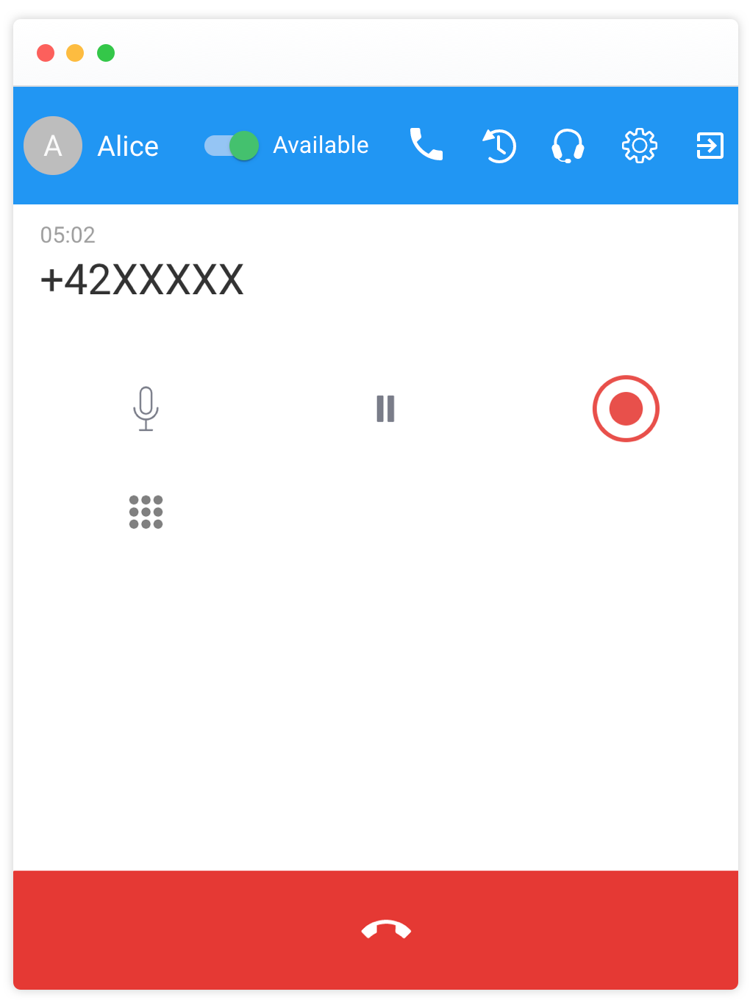
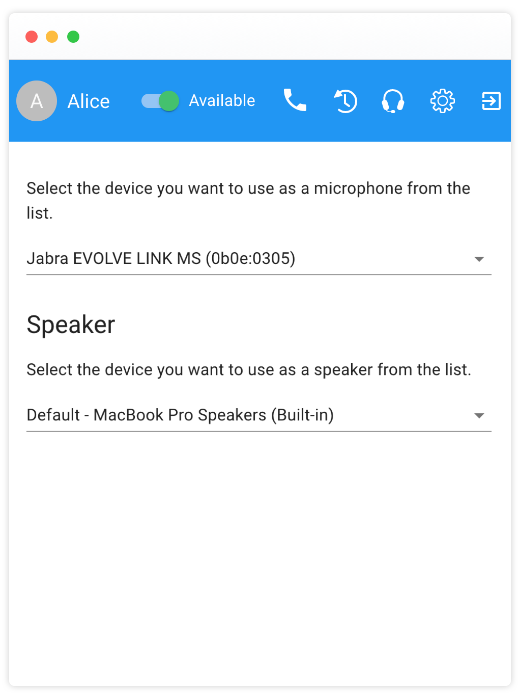
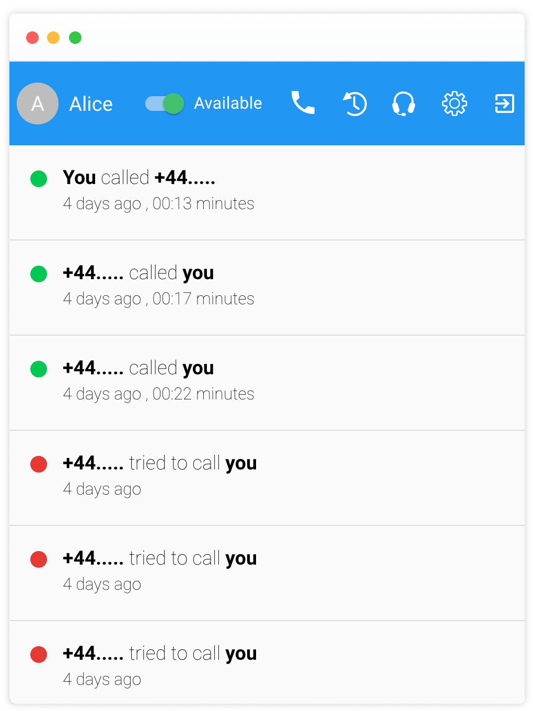
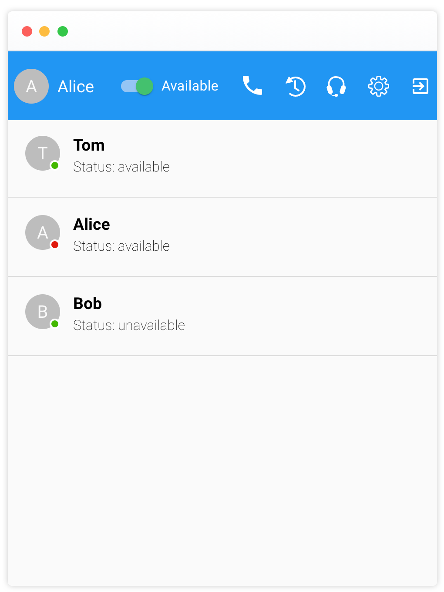

## Dial Pad

This is the main view of the phone the user will see after login. Users can enter a phone number with the dialpad buttons or with a cursor click on the phone display and then entering a number with the keyboard.

The `+` is automatically added to every phone number. Phone numbers are not checked for validity, users can dial phone numbers if the lenght is greater than 6 characters. After pressing the green `call` button the call is connected.

    

## Handling Phone Calls

While on a call, users have the following control buttons.

`mute` the microphone
`hold` the caller, while hold is active the caller can hear waiting music.
`record` the call, the recording can be started and paused.
`keypad`, show the telephone keypad, for instance to call an IVR and press buttons.

    

## Input and Output Devices

By clicking the `headphone` icon, users select an input and output device for the call. The settings are stored in the local browser session and will be restored upon reload. The available devices will depend on the browser you are using, for instance Firefox currently does not suppport a speaker device.

    

## Call History

Calls are stored on the backend, the last 50 calls are displayed at maximum. Each of the call history entries can be clicked and the number will be added to the dialpad.

    

## Users

Online users are displayed in a list with the current live status.

    

