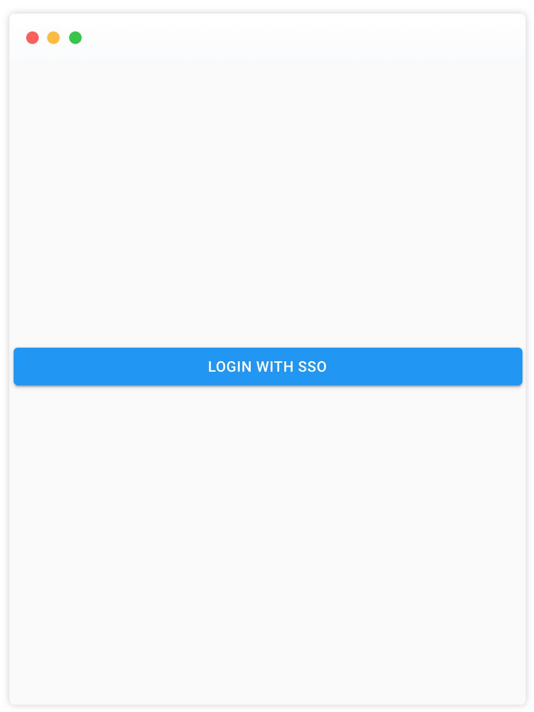

## SAML User Authentication

You can use SAML 2.0 to authenticate users. SAML stands for **Security Assertion Markup Language**. It's an open-standard for transferring identity data between two parties. The next steps will describe how to set it up.

### Before You Get Started

Install the project and set up the account once by registering, in the next step we will configure this account for SAML authentication.

Go to your database and copy the account ID that was created during sign up. Another option is to fetch the account information from the API. The repository contains a [Summer Camp OpenAPI](https://github.com/public-park/summer-camp/blob/master/api-summer-camp.yaml) file, this definition file can be imported with many tools and it will generate requests automatically for you.

Configure your identity provider, set the **sign on URL** and the **destination URL** to

`http://<your-server-url>/saml/<accountId>/authenticate`

Set the **audience URI** to

`http://\your-server-url\>/saml/\<accountId>`

Download the SAML 2.0 XML metadata from your identity provider and store it in the root directory.

### Configure Environment Variables

There are three environment variables you need to set for SAML authentication. Please note, this guide describes how to set it on a NodeJS environment. If you are running this project on [Heroku](https://www.heroku.com) or any other application hosting provider, please check how to set environment variables there.

#### Environment Variables

`REACT_APP_AUTHENTICATION_MODE` set this value to `saml`, it will deactivate the local user authentication on the frontend.

`REACT_APP_SAML_AUTHENTICATION_ACCOUNT_ID` set it to the UUID of your account.

`SAML_AUTHENTICATION_PUBLIC_URL` this is the file name of your SAML metadata file

`SAML_AUTHENTICATION_METADATA` set this to the public url of your installation, the server backend will redirect to this url and set the JWT token.

Here is an example for a possible configuration.

```REACT_APP_AUTHENTICATION_MODE=saml
REACT_APP_SAML_AUTHENTICATION_ACCOUNT_ID=4d8b25ff-0344-47ef-9ed0-3db8ae27bee5
SAML_AUTHENTICATION_PUBLIC_URL=https://<my-public-server.com>/
SAML_AUTHENTICATION_METADATA=saml2-metadata.xml

```

Our local configuration is complete. If you now start the project in a browser you should see the SSO login screen instead of the login form.

<p align="center">
    
</p>

### Configure User Attributes

The application requires two mandatory attributes to be returned by the identity provider,

- `role`, the role you want to assign to the user can be `agent` or `owner`. Please read [How to Manage Users](manage-users.md) for more details.
- `name`, a friendly name for the user

Users can now sign up with your identity provider. The local user you originally signed up with cannot be used for login anymore, you can delete it from the database if needed.
